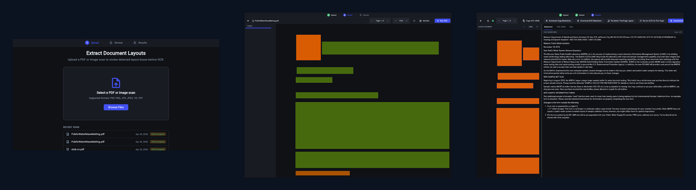
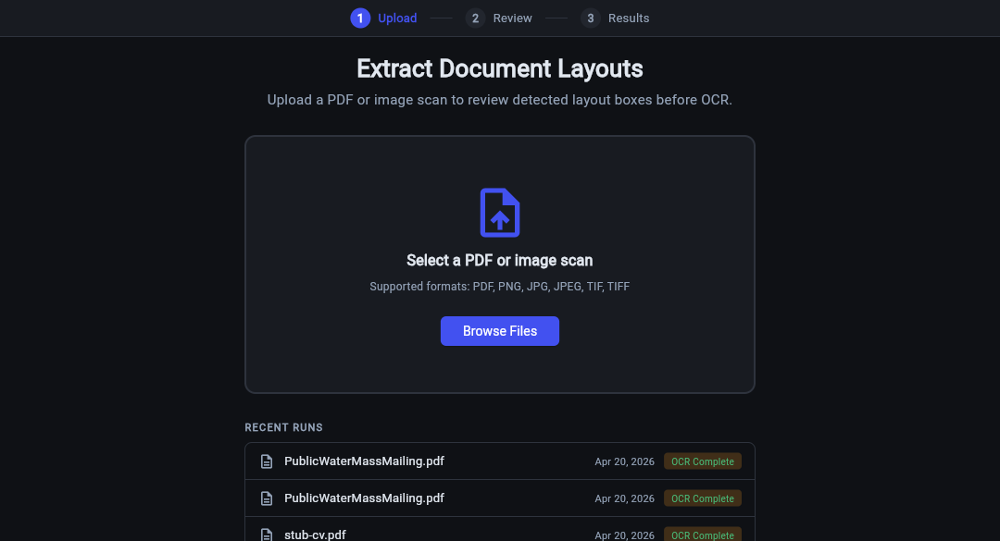
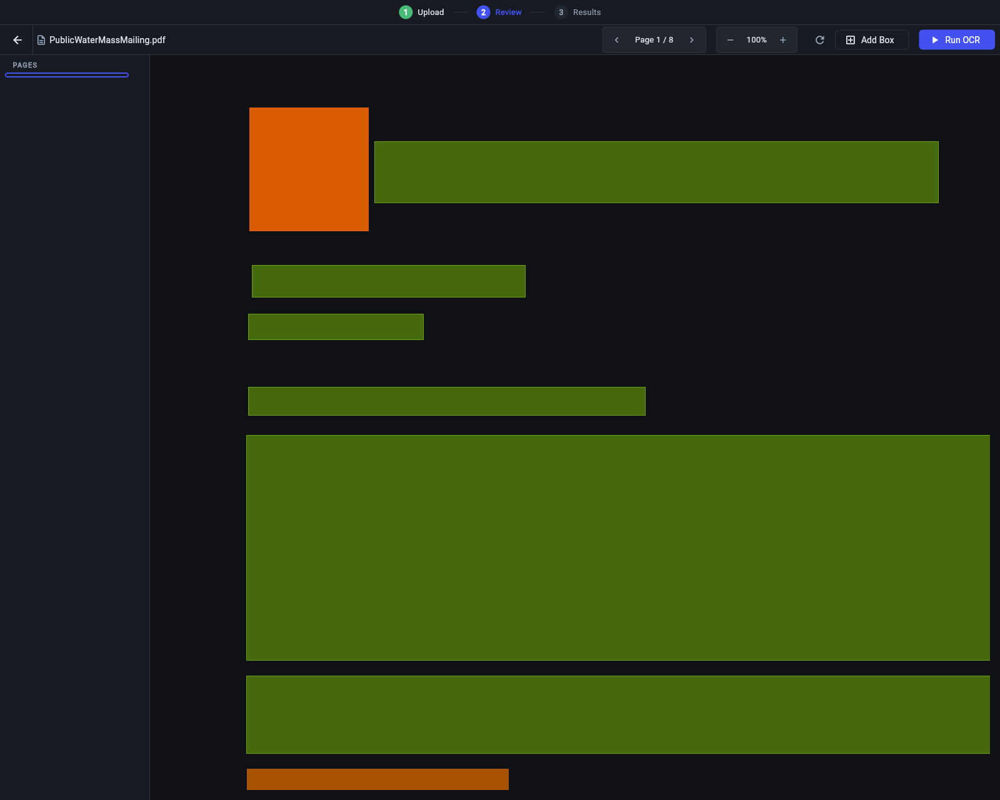
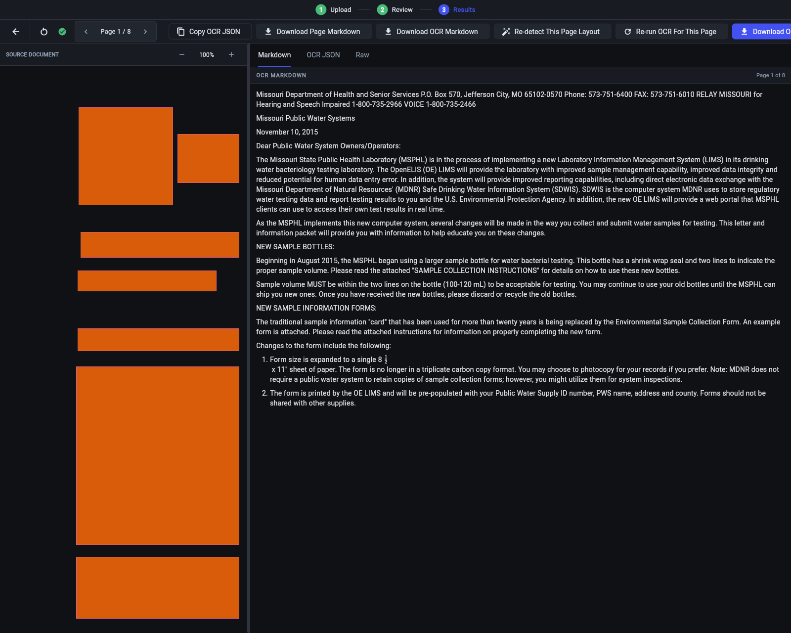

# free-doc-extract

<p align="center">
  
</p>

<p align="center">
  
  
  
  
</p>

Local-first document extraction workbench for PDFs and scanned images.

`free-doc-extract` turns a document into normalized page images, lets you review and correct the detected layout before OCR, stores reproducible run artifacts, and supports both rule-based and LLM-based structured extraction on top of the OCR output.

The screenshots in this README are real GUI captures from a local demo run of [`docs/demo/PublicWaterMassMailing.pdf`](docs/demo/PublicWaterMassMailing.pdf), a public sample document checked into the repo for reproducible screenshots.

## Why It Works Well In Practice

- Review-first workflow. You do not have to accept OCR output blindly. The app exposes page-level layout boxes before extraction so you can correct the structure that downstream OCR depends on.
- Local stack. OCR and structured extraction run against local Ollama endpoints instead of a hosted SaaS dependency.
- Reproducible runs. Each document gets a run folder with pages, raw OCR payloads, markdown, JSON, metadata, predictions, and reports.
- Multi-path extraction. You can compare a deterministic rules baseline against direct structured generation.
- Evaluation built in. Gold labels and markdown reports make it easy to measure changes instead of guessing.

## Product Walkthrough

### 1. Upload A Document

Start from a focused upload screen with a clear document drop zone, lightweight run history, and local Ollama status.

<p align="center">
  
</p>

### 2. Review The Layout

The core idea of the project is here: inspect the detected regions, move page by page, add boxes, remove boxes, and fix the layout before OCR becomes canonical.

<p align="center">
  
</p>

### 3. Inspect OCR Results

Once OCR is complete, the results workspace keeps the document, markdown, JSON, and raw page payloads side by side so debugging extraction quality is fast.

<p align="center">
  
</p>

## Core Flow

1. Ingest a PDF or image.
2. Normalize it into ordered page images.
3. Detect document layout locally.
4. Review and adjust the layout in the UI.
5. Run OCR and generate page-level markdown and JSON.
6. Extract structured fields with rules or with Ollama.
7. Evaluate predictions against hand-labeled gold data.

## Quick Start

### Requirements

- Python `3.11`, `3.12`, or `3.13`
- `uv`
- Ollama running locally

### Install

```bash
uv python install 3.11
uv venv --python 3.11
uv sync --group dev --extra pdf --extra glmocr
```

### Pull The OCR Model

```bash
ollama pull glm-ocr:latest
ollama serve
```

The default OCR endpoint is `http://localhost:11434/api/generate`.

### Launch The UI

Desktop app:

```bash
uv run free-doc-extract-ui
```

Browser mode:

```bash
uv run python -m free_doc_extract.ui --web --host 127.0.0.1 --port 8550
```

### Run The CLI Pipeline

OCR only:

```bash
uv run python -m free_doc_extract.cli ocr data/raw/PublicWaterMassMailing.pdf --run demo001
```

Rule-based extraction:

```bash
uv run python -m free_doc_extract.cli extract-rules --run demo001
```

Direct structured extraction:

```bash
uv run python -m free_doc_extract.cli extract-glmocr --run demo001
```

End-to-end OCR plus rule extraction:

```bash
uv run python -m free_doc_extract.cli run data/raw/PublicWaterMassMailing.pdf --run demo001
```

Evaluate predictions:

```bash
uv run python -m free_doc_extract.cli eval \
  --gold-dir data/gold \
  --pred-dir data/runs/demo001/predictions \
  --output data/reports/demo001.md
```

## What Gets Written To Disk

Each run lands in `data/runs/<run-id>/`.

```text
data/runs/demo001/
  pages/
  ocr_raw/
  reviewed_layout.json
  ocr.md
  ocr.json
  ocr_fallback.json
  meta.json
  predictions/
```

Important files:

- `reviewed_layout.json`: the page-by-page layout state used by the review step
- `ocr.md`: merged markdown output for the run
- `ocr.json`: project-owned OCR payload with page records and references to raw SDK artifacts
- `ocr_raw/`: saved GLM-OCR model payloads per page
- `predictions/`: rules and structured extraction outputs

## Tech Stack

- UI: Flet
- OCR pipeline: GLM-OCR
- Local inference serving: Ollama
- PDF/image normalization: Pillow and PyMuPDF
- Evaluation and reporting: project-native Python utilities

## Repository Layout

```text
src/free_doc_extract/
  cli.py
  ingest.py
  ocr.py
  ocr_fallback.py
  workflows.py
  review_artifacts.py
  evaluate.py
  experimental/extract_glmocr.py
  ui/

data/
  raw/
  gold/
  runs/
  reports/
```

## Make Targets

```bash
make install
make test
make lint
make report RUN_ID=demo001
```

## Current Limits

- PDF rasterization requires the `pdf` extra.
- OCR and structured extraction both assume a local Ollama setup is available.
- The rules extractor is intentionally narrow and should be treated as a baseline.
- Very large or visually dense pages can still stress local inference latency.

## Dev Note

The repo also includes a localhost-only MCP sidecar under [`tools/dev_mcp/README.md`](tools/dev_mcp/README.md) for UX review workflows and automated feedback capture.
